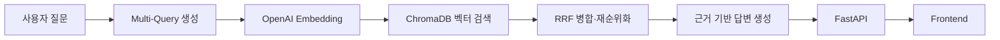
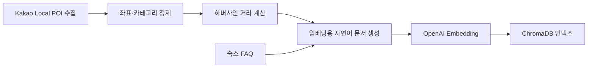

# 🏝️ 버킷 제주

> 혼자 온 제주 여행자를 위한 초지역 정보 검색·순간 동행 서비스  
> 모두의연구소 DLThon · Team **동행어때**

<p align="center">
  
</p>

<p align="center">
  <a href="https://bucket-jeju-join.ep01-sleepwar.chatgpt.site">웹 데모</a> ·
  <a href="./deliverables/presentation/버킷제주_발표.pptx">발표 자료</a> ·
  <a href="./docs/api_contract.md">API 문서</a> ·
  <a href="./deliverables/docs/RAG_평가서.md">RAG 평가서</a>
</p>


## 한눈에 보기

| 항목 | 내용 |
|---|---|
| **해결할 문제** | 혼행객이 숙소 주변의 도보권 정보와 일시적인 동행을 찾기 어려운 문제 |
| **해결 방법** | 숙소 기준 근거 기반 RAG 검색과 투숙객 Join 커뮤니티 결합 |
| **타겟** | 제주 대정읍 버킷 제주 게스트하우스의 혼자 여행하는 20‑30대 투숙객 |
| **핵심 기술** | Multi-Query, Reciprocal Rank Fusion, OpenAI Embedding, ChromaDB, FastAPI |
| **개발 기간** | 2026.07.30‑07.31, 2026.08.10‑08.11 (총 4일) |
| **주최** | 모두의연구소 DLThon |
| **팀** | 동행어때 — 이다겸, 조현겸, 이예령, 정슬기 |

## 기술 스택

| 영역 | 기술 | 사용 목적 |
|---|---|---|
| **RAG** | OpenAI `text-embedding-3-small`, `gpt-4o-mini`, ChromaDB | 질문·문서 임베딩, 벡터 검색, 근거 기반 답변 생성 |
| **Backend** | Python, FastAPI, Pydantic | RAG·Join·투숙객 API 제공 |
| **Frontend** | React 19, TypeScript, Next.js/Vinext, Tailwind CSS | 지도, Join, AI 질문 화면 구현 |
| **Database** | Cloudflare D1, Drizzle ORM | 웹 데모의 사용자·Join 데이터 관리 |
| **Data** | Pandas, Kakao Local POI | 주변 POI 수집·정제·거리 계산 |
| **Evaluation** | RAGAS 0.2+ | 응답의 충실성·관련성과 검색 성능 평가 |

## 팀 구성 및 역할

| 팀원 | 역할 | 담당 업무 |
|---|---|---|
| **이다겸** | **PL · RAG** | 프로젝트 제안 및 일정 조율, 지식베이스 스키마 설계, RAG 파이프라인 구현, RAGAS 평가 총괄, 프론트엔드 연동 |
| **조현겸** | **데이터** | POI 데이터 수집·정제 및 EDA |
| **이예령** | **백엔드** | FastAPI 기반 서비스 API 구현 |
| **정슬기** | **프론트엔드** | 지도, Join 기능 및 웹 데모 구현 |

## 문제 정의

혼자 여행하는 게스트하우스 투숙객은 두 가지 문제를 겪습니다.

1. 식당·편의점·해변·교통과 같은 숙소 주변 정보가 여러 플랫폼에 흩어져 있어, **지금 걸어서 갈 수 있는 곳**을 빠르게 찾기 어렵습니다.
2. 혼밥이나 액티비티를 함께할 사람이 필요해도, 짧은 체류 기간 동안 부담 없이 **순간 동행**을 찾기 어렵습니다.

버킷 제주는 특정 숙소를 정보 탐색과 사람 연결의 기준점으로 삼아, 숙소 주변에서 바로 실행할 수 있는 초지역 서비스를 제안합니다.

## 서비스 소개

### AI 근거리 정보 검색

- “혼자 가기 좋은 가까운 식당은?”처럼 자연어로 질문합니다.
- 숙소 주변 POI와 숙소 FAQ를 하나의 지식베이스에서 검색합니다.
- Multi-Query로 다양한 질문 표현을 보완하고 RRF로 검색 결과를 병합합니다.
- 검색 근거가 부족하면 답을 지어내지 않고 안내 데스크 문의를 유도합니다.

### Join 커뮤니티

- 식사·관광·액티비티를 함께할 순간 동행을 모집합니다.
- 모집 중, 모집 완료, 일정 완료의 세 상태로 Join을 관리합니다.
- 숙소 투숙객이 필요한 순간만 연결될 수 있는 지역 커뮤니티를 지향합니다.

> **탐색 반경**  
> 기획 단계에서는 2km를 기준으로 설정했고, RAG 파이프라인의 최종 적용 반경은 도보 이동 범위를 고려해 1.5km로 조정했습니다. 별도로 구현된 웹 데모의 지도는 2km 가이드를 표시합니다.

## 주요 화면

| 근처 발견 지도 | AI 질문 | Join 커뮤니 |
|---|---|---|
| 실제 POI 좌표와 카테고리 필터 | 근거 기반 숙소·주변 정보 응답 | 동행 모집·조회와 상태 관리 |

> 현재 저장소에는 서비스 소개 이미지가 포함되어 있습니다. 세 기능의 실제 사용 화면은 추후 GIF 또는 스크린샷으로 보강할 예정입니다.

## 핵심 기술적 도전

### 1. 질문과 문서의 표현 불일치 해결

“담배”와 “흡연”, “정류장”과 “버스 정류장”처럼 의도는 같지만 표현이 다른 질문에서 단일 벡터 검색은 근거를 놓쳤습니다. 원본 질문의 대체 표현을 생성해 각각 검색하고, **Reciprocal Rank Fusion**으로 결과를 병합해 검색 커버리지를 높였습니다.

### 2. 의미 유사도와 물리적 거리의 충돌 해결

초기 재순위화는 거리를 과도하게 중시해 질문과 무관한 가까운 문서를 상위에 노출했습니다. 벡터 유사도 순서를 우선하고 `solo_friendly` 정보와 거리를 보조 신호로 제한해 질문 관련성을 보존했습니다.

### 3. 데이터 공백에서의 환각 방지

약국·병원·대형마트 등 인덱스에 존재하지 않는 카테고리에서 잘못된 장소를 생성하는 문제를 발견했습니다. 해당 질문은 검색·생성 이전에 감지해 데이터 부족을 명시하고 프런트 데스크 문의를 안내하도록 했습니다.

### 4. 평가 파이프라인의 무결성 확보

평가 스크립트가 구버전 RAG 모듈을 가리키는 문제를 수치 이상에서 역추적했습니다. 파이프라인 버전과 import 경로를 재검증하고 동일한 28개 질문으로 버전별 성능을 다시 비교했습니다.

## 시스템 아키텍처



### 구현 범위 구분

| 구분 | 구성 | 상태 |
|---|---|---|
| **RAGAS 평가 대상** | FastAPI + ChromaDB + OpenAI RAG | 로컬에서 프론트엔드 연동 동작 확인 |
| **공개 웹 데모** | React/Vinext + Cloudflare D1 + 인메모리 RAG | 별도 아키텍처로 구현·배포 |

RAGAS 수치를 산출한 파이프라인과 공개 웹 데모는 서로 다른 아키텍처입니다. RAG 백엔드와 프론트엔드의 연동은 로컬에서 검증했으며, 팀 일정상 공개 데모에는 반영하지 못했습니다.

## 데이터 파이프라인



- POI 좌표를 정제하고 숙소와의 거리를 하버사인 공식으로 계산했습니다.
- RAG·매칭에서 같은 거리 기준을 사용하도록 `backend/utils/geo.py`로 공통화했습니다.
- POI 속성을 자연어 문서로 변환해 임베딩하고, 숙소 FAQ와 함께 `poi` 컬렉션에 저장했습니다.

## RAG 평가 결과

RAGAS 0.2+로 정보 QA 20문항과 함정 질문 8문항, 총 28문항을 평가했습니다.

| 버전 | Faithfulness | Answer Relevancy | Context Precision | Context Recall |
|---|---:|---:|---:|---:|
| Baseline | 0.531 | 0.268 | 0.426 | 0.196 |
| V1 — 재순위화 버그 수정 | 0.592 | 0.315 | 0.521 | 0.232 |
| V2 — 데이터 공백 가드 | 0.620 | 0.294 | 0.476 | 0.268 |
| **V3 — Multi-Query + RRF** | **0.514** | **0.319** | **0.440** | **0.429** |

Multi-Query와 RRF를 도입해 **Context Recall을 0.196에서 0.429로 약 2.2배** 높였습니다. 다만 검색 범위가 넓어지면서 Faithfulness가 하락하는 트레이드오프도 확인했습니다. 이 프로젝트에서는 사용자의 다양한 표현에서 필요한 주변 정보를 놓치지 않는 것을 중요하게 보아 Context Recall을 핵심 지표로 삼았습니다.

> 위 표의 공식 발표 기준은 V3입니다. 상세한 평가 방법과 결과는 [`deliverables/docs/RAG_평가서.md`](./deliverables/docs/RAG_평가서.md)에서 확인할 수 있습니다.

## 디렉터리 구조

```text
DLthon_2nd/
├── backend/
│   ├── main.py                 # FastAPI 앱·엔드포인트
│   ├── build_index.py          # POI·FAQ 임베딩 및 인덱싱
│   ├── services/rag_service.py # Multi-Query·RRF·답변 생성
│   └── utils/geo.py             # 숙소 기준 거리 계산
├── frontend/                       # React/Vinext 웹 데모
├── data/
│   ├── raw/                    # 원본 데이터
│   ├── processed/              # 정제 POI·숙소 FAQ
│   ├── index/chroma/           # ChromaDB 영구 인덱스
│   └── eval/                   # 골드 QA·함정 질문·평가 결과
├── docs/                            # API·KB 스키마·디버깅 문서
└── deliverables/                    # 발표·평가·통합 산출물
```

## 로컬 실행 방법

### 1. 저장소 복제 및 Python 환경 구성

```bash
git clone https://github.com/gon311/DLthon_2nd.git
cd DLthon_2nd

python -m venv .venv
source .venv/bin/activate
pip install -r requirements.txt
```

Windows에서는 가상환경을 `.venv\Scripts\activate`로 활성화합니다.

### 2. 환경변수 설정

```bash
export OPENAI_API_KEY="your-openai-api-key"
```

필요하면 CORS 허용 주소를 쉼표로 구분해 지정합니다.

```bash
export ALLOWED_ORIGINS="http://localhost:3000,http://localhost:8501"
```

### 3. ChromaDB 인덱스 구축

저장소에 포함된 인덱스를 다시 구축하려면 다음 명령을 실행합니다.

```bash
python backend/build_index.py \
  --csv data/processed/guesthouse_pois.csv \
  --faq data/processed/guesthouse_faq.json \
  --collection poi
```

### 4. FastAPI 실행

```bash
uvicorn backend.main:app --reload
```

- API: `http://127.0.0.1:8000`
- Swagger UI: `http://127.0.0.1:8000/docs`
- 헬스 체크: `http://127.0.0.1:8000/health`

### 5. 웹 프론트엔드 실행

Node.js 22.13 이상이 필요합니다.

```bash
cd frontend
npm install
npm run dev
```

## API 사용 예시

### RAG 질문

```http
POST /api/v1/ask
Content-Type: application/json

{
  "question": "혼자 가기 좋은 가까운 식당을 알려줘"
}
```

```json
{
  "query": "혼자 가기 좋은 가까운 식당을 알려줘",
  "answer": "검색된 근거를 바탕으로 생성한 답변",
  "sources": [
    {
      "name": "POI 이름",
      "category_norm": "식당",
      "distance_m": 500,
      "similarity_score": 0.87
    }
  ]
}
```

### 주요 엔드포인트

| Method | Endpoint | 설명 |
|---|---|---|
| `GET` | `/health` | 서버·시드 데이터 상태 확인 |
| `POST` | `/api/v1/ask` | RAG 기반 숙소·근거리 질문 |
| `GET` | `/api/v1/joins` | Join 목록 조회·필터링 |
| `GET` | `/api/v1/joins/{join_id}` | Join 상세 조회 |
| `GET` | `/api/v1/guests` | 투숙객 목록 조회 |

## 한계와 향후 개선

- **아키텍처 통합:** 평가된 RAG 백엔드를 공개 웹 데모에 정식으로 연결
- **데이터 확충:** 약국·병원·마트 등 누락 카테고리를 보강하고 POI를 주기적으로 갱신
- **검색 개선:** BM25와 임베딩을 결합한 하이브리드 검색과 출처 문장 표시 도입
- **안전 장치:** Join 신고·차단·투숙 인증 및 참여·취소 데이터 영구 저장
- **서비스 확장:** 하나의 숙소에 고정된 구조를 다중 숙소를 지원하는 구조로 확장
- **평가 고도화:** 골드 POI 라벨을 기준으로 Retrieval Recall@k를 추가 계산하고 실사용자 평가 병행

## 관련 문서

| 문서 | 설명 |
|---|---|
| [`docs/kb_schema.md`](./docs/kb_schema.md) | 지식베이스 스키마 |
| [`docs/api_contract.md`](./docs/api_contract.md) | API 인터페이스 계약 |
| [`docs/DEBUGGING_HISTORY.md`](./docs/DEBUGGING_HISTORY.md) | 핵심 문제 해결 기록 |
| [`data/eval/README.md`](./data/eval/README.md) | 평가 데이터 구성 |
| [`deliverables/docs/RAG_평가서.md`](./deliverables/docs/RAG_평가서.md) | RAGAS 평가 방법·결과 |
| [`frontend/README.md`](./frontend/README.md) | 웹 데모 구성·실행 안내 |

## License

이 저장소에는 현재 별도의 오픈소스 라이선스가 명시되어 있지 않습니다.
